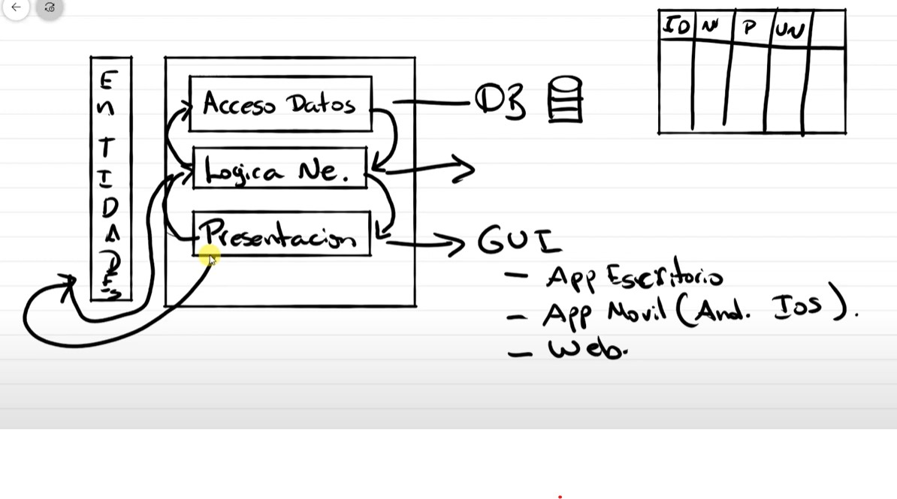

# ProyectoCursoCS
Proyecto para aprender a usar windows forms con arquitectura de n-capas

## Tabla de contenido
- [ProyectoCursoCS](#proyectocursocs)
- [Tabla de contenido](#tabla-de-contenido)  
## Arquitectura de N-Capas
Consta de un mínimo de 3 capas.  
**1. Capa de acceso a datos:** Se conecta a la BD  
**2. Capa de lógica de negocios:** Métodos para conectarse a la BD  
**3. Capa de presentación:**  Interfaz gráfica (GUI). Puede ser una aplicación móbil, web, de escritorio, etc.  
**4. Capa de entidades:** Afecta a todos el proyecto. Son las tablas que existen en nuestra BD. Son un reflejo de lo que hacemos en BD.  

  

